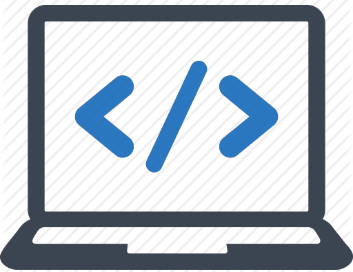
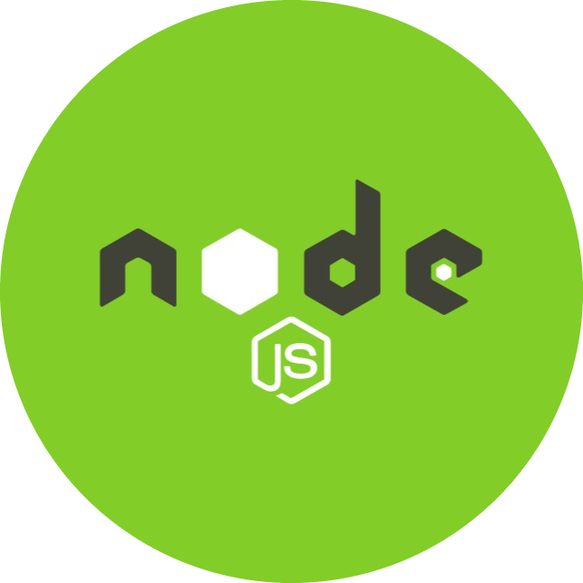

<h1 align='center'> Hi there! I'm Subachandran  </h1>

<h2> &nbsp; About Me </h2>

 I'm a programmer with lot of passion towards solving problems and learning new technologies. I love to explore different languages and frameworks and always eager to try new things.
 
 - <b>Graduation:</b> B.Tech-Bioinformatics, SASTRA University
 - <b>Interests:</b> Web Development, Programming, Debugging
 - <b>Location:</b> Tamil Nadu, India

 
<h2> &nbsp; Skills </h2>

<h3> Front-End </h3>

   &nbsp; HTML 

   &nbsp; CSS 

   &nbsp; JavaScript 

   &nbsp; jQuery 

   &nbsp; Bootstrap 

<h3> Back-End </h3>

   &nbsp; Node-JS 

   &nbsp; Express

   &nbsp; EJS

   &nbsp; PHP

<h3> Database </h3>

   &nbsp; MongoDB 

   &nbsp; MySQL

   &nbsp; Oracle SQL

<h3> Programming anguages </h3>

   &nbsp; Python 

